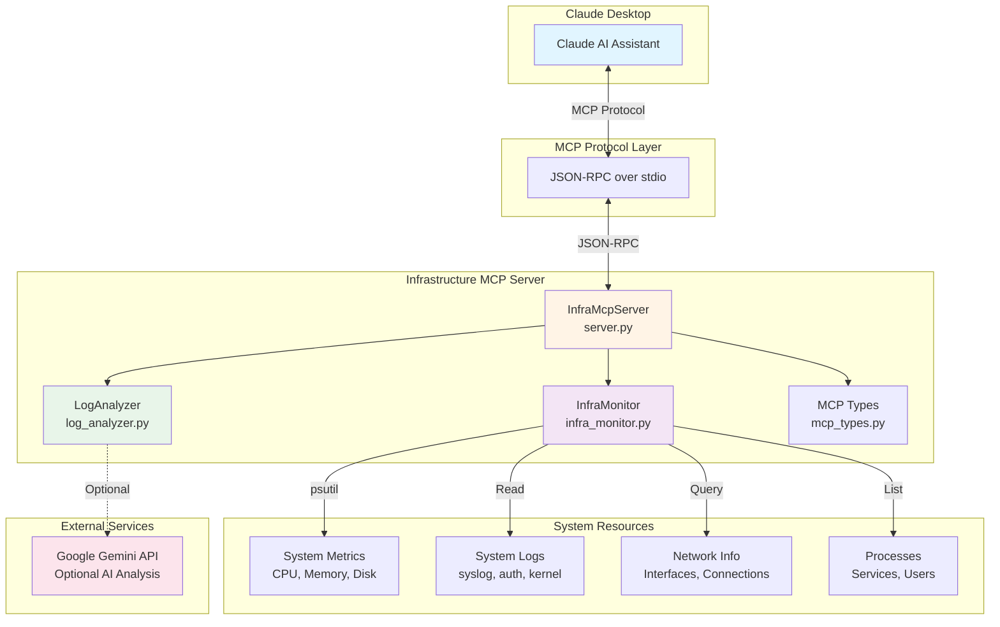
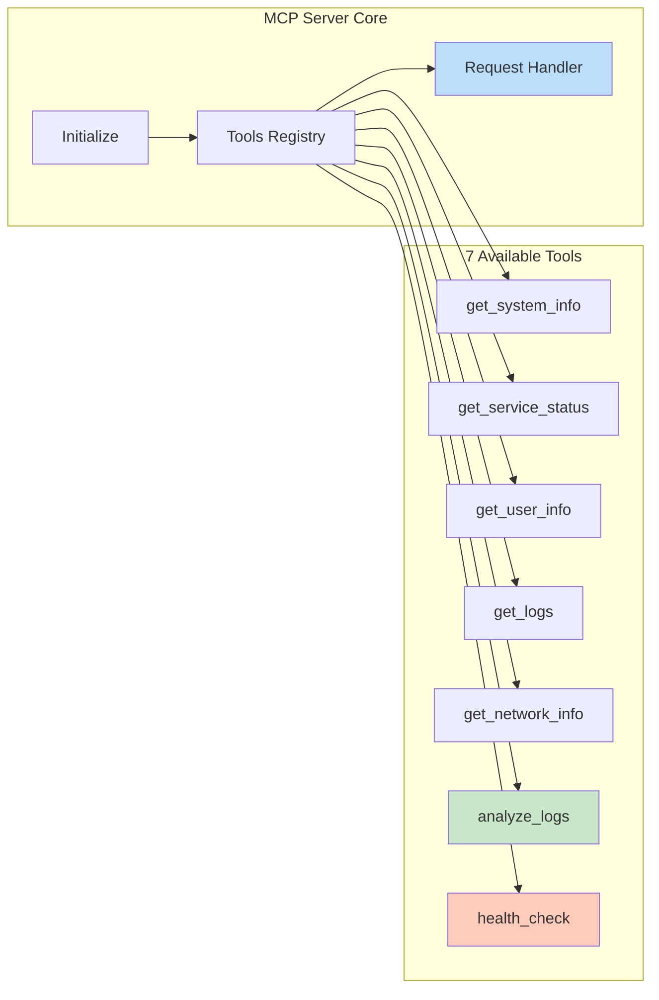
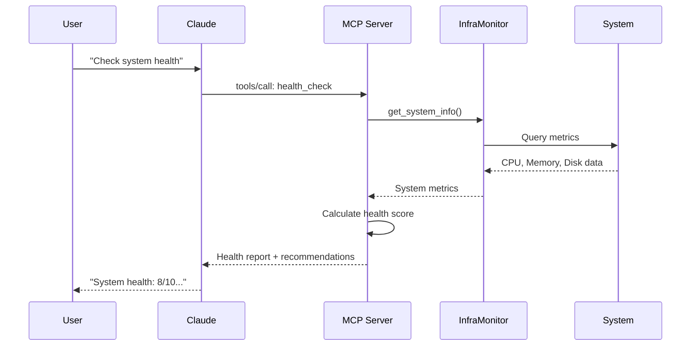
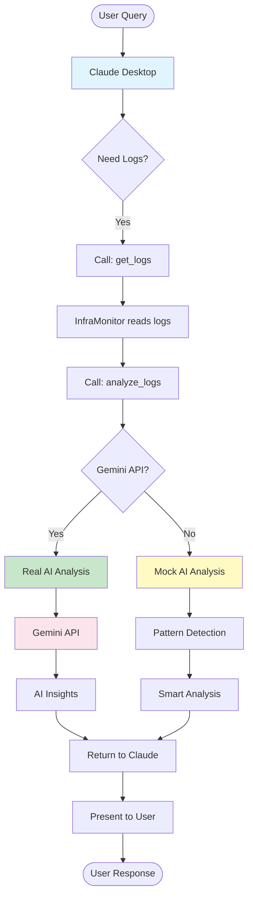
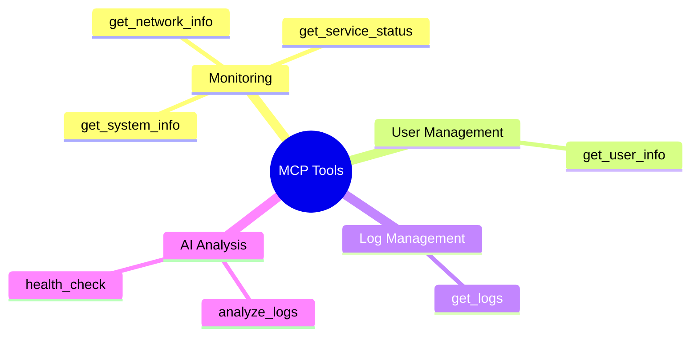
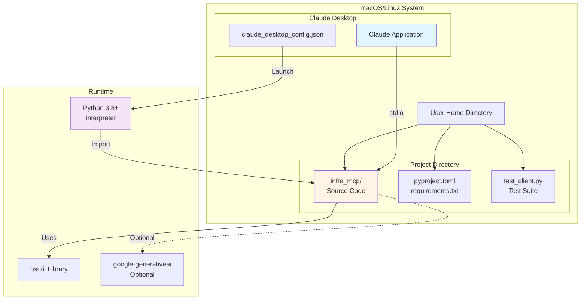
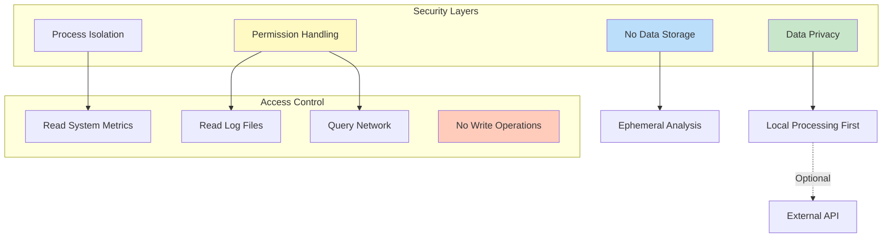
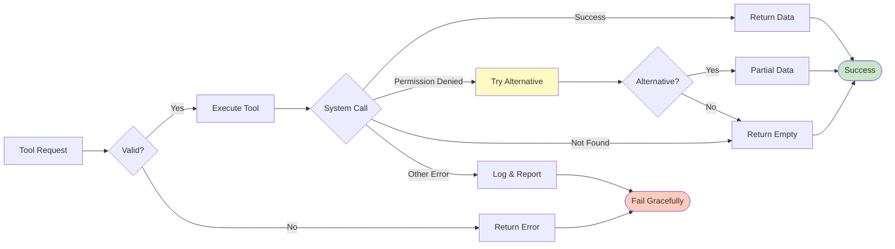

# Infrastructure MCP Server - Architecture Diagrams

This document contains architecture diagrams for the Infrastructure MCP Server using Mermaid syntax.

## System Architecture Overview

## Component Architecture

## Data Flow - Tool Execution

## Log Analysis Flow

## Tool Categories

## Deployment Architecture

## Security Model

## Error Handling Flow

---

## Legend

- **Blue boxes**: Client/User interfaces
- **Yellow boxes**: Core server components
- **Purple boxes**: Infrastructure components
- **Green boxes**: AI/Analysis components
- **Pink boxes**: External services
- **Orange boxes**: Health monitoring

## Viewing These Diagrams

These diagrams use Mermaid syntax and can be viewed in:
- GitHub (native support)
- VS Code (with Mermaid extension)
- Any Markdown viewer with Mermaid support
- [Mermaid Live Editor](https://mermaid.live/)

## Related Documentation

- [Architecture Details](../reference/ARCHITECTURE.md) - Detailed technical architecture
- [Quick Start](../getting-started/QUICK_START.md) - Getting started guide
- [Setup Guide](../setup/CLAUDE_DESKTOP_SETUP.md) - Configuration instructions

