# Infrastructure MCP Server - Architecture Diagrams (v2.0)

This document contains architecture diagrams for the Infrastructure MCP Server using Mermaid syntax.

## 🆕 Version 2.0 Highlights

**Major Update**: Ollama Integration for Privacy-First AI Analysis

- ✅ **Ollama as Primary LLM**: 100% local, private, no API costs
- ✅ **Intelligent Fallback**: Ollama → Gemini → Mock Mode
- ✅ **Enhanced Privacy**: Infrastructure data never leaves your machine (with Ollama)
- ✅ **Zero Cost**: Free unlimited AI analysis with Ollama
- ✅ **Offline Capable**: Works without internet connection

**Key Changes in v2.0:**
- New LLM selection and fallback architecture
- Ollama service integration (localhost:11434)
- Enhanced security and privacy model
- Updated deployment architecture
- Protocol version: 2025-06-18

## System Architecture Overview


## Component Architecture


## Data Flow - Tool Execution


## Log Analysis Flow (with LLM Priority)

```mermaid
flowchart TD
    START([User Query]) --> CLAUDE[Claude Desktop]
    CLAUDE --> DECIDE{Need Logs?}
    DECIDE -->|Yes| GETLOGS[Call: get_logs]
    GETLOGS --> READLOGS[InfraMonitor reads logs]
    READLOGS --> ANALYZE[Call: analyze_logs]
    
    ANALYZE --> TRY_OLLAMA{Try Ollama<br/>localhost:11434}
    
    TRY_OLLAMA -->|Available ✅| OLLAMA[Ollama Local LLM<br/>Priority 1]
    TRY_OLLAMA -->|Failed ❌| TRY_GEMINI{Try Gemini<br/>API Key?}
    
    OLLAMA -->|Success| RESULT_OLLAMA[AI Analysis<br/>100% Local]
    OLLAMA -->|Failed| TRY_GEMINI
    
    TRY_GEMINI -->|Available ✅| GEMINI[Gemini Cloud API<br/>Priority 2]
    TRY_GEMINI -->|Failed ❌| MOCK
    
    GEMINI -->|Success| RESULT_GEMINI[AI Analysis<br/>Cloud-based]
    GEMINI -->|Failed| MOCK[Mock Mode<br/>Priority 3]
    
    MOCK --> RESULT_MOCK[Pattern Analysis<br/>Always Works]
    
    RESULT_OLLAMA --> RETURN[Return to Claude]
    RESULT_GEMINI --> RETURN
    RESULT_MOCK --> RETURN
    
    RETURN --> PRESENT[Present to User]
    PRESENT --> END([User Response])
    
    style CLAUDE fill:#e1f5ff
    style OLLAMA fill:#c8e6c9
    style GEMINI fill:#fce4ec
    style MOCK fill:#fff9c4
    style RESULT_OLLAMA fill:#c8e6c9
    style RESULT_GEMINI fill:#fce4ec
    style RESULT_MOCK fill:#fff9c4
```



## LLM Selection Flow

```mermaid
flowchart TD
    START([Server Startup]) --> INIT[LogAnalyzer.__init__]
    
    INIT --> CHECK_OLLAMA{Check Ollama<br/>localhost:11434}
    
    CHECK_OLLAMA -->|GET /api/tags| OLLAMA_CHECK[Try Connect]
    
    OLLAMA_CHECK -->|200 OK ✅| OLLAMA_SUCCESS[Set mode: ollama<br/>Detect models<br/>llama3.2, llama3.1...]
    OLLAMA_CHECK -->|Failed ❌| CHECK_GEMINI{Check Gemini<br/>API Key}
    
    CHECK_GEMINI -->|GEMINI_API_KEY<br/>exists ✅| GEMINI_SUCCESS[Set mode: gemini<br/>Initialize client]
    CHECK_GEMINI -->|No key ❌| MOCK_MODE[Set mode: mock<br/>Pattern-based]
    
    OLLAMA_SUCCESS --> READY1[Ready: Priority 1<br/>✅ 100% Local<br/>✅ No cost<br/>✅ Private]
    GEMINI_SUCCESS --> READY2[Ready: Priority 2<br/>⚠️ Cloud-based<br/>⚠️ API costs<br/>⚠️ Requires key]
    MOCK_MODE --> READY3[Ready: Priority 3<br/>✅ Always works<br/>✅ No dependencies<br/>⚠️ Basic analysis]
    
    READY1 --> RUNTIME([Runtime: Try Ollama first])
    READY2 --> RUNTIME
    READY3 --> RUNTIME
    
    style OLLAMA_SUCCESS fill:#c8e6c9
    style GEMINI_SUCCESS fill:#fce4ec
    style MOCK_MODE fill:#fff9c4
    style READY1 fill:#c8e6c9
    style READY2 fill:#fce4ec
    style READY3 fill:#fff9c4
```



## LLM Fallback Strategy

```mermaid
graph LR
    REQUEST[Analysis Request] --> TRY1{Ollama Mode?}
    
    TRY1 -->|Yes| CALL_OLLAMA[Call Ollama API]
    TRY1 -->|No| TRY2{Gemini Mode?}
    
    CALL_OLLAMA -->|Success ✅| RETURN1[Return Analysis]
    CALL_OLLAMA -->|Failed ❌| FALLBACK1[Try Gemini]
    
    FALLBACK1 --> HAS_GEMINI{Has API Key?}
    HAS_GEMINI -->|Yes| CALL_GEMINI[Call Gemini API]
    HAS_GEMINI -->|No| CALL_MOCK
    
    TRY2 -->|Yes| CALL_GEMINI
    TRY2 -->|No| CALL_MOCK[Mock Analysis]
    
    CALL_GEMINI -->|Success ✅| RETURN2[Return Analysis]
    CALL_GEMINI -->|Failed ❌| CALL_MOCK
    
    CALL_MOCK --> RETURN3[Return Analysis<br/>Always Succeeds]
    
    RETURN1 --> END([Complete])
    RETURN2 --> END
    RETURN3 --> END
    
    style CALL_OLLAMA fill:#c8e6c9
    style CALL_GEMINI fill:#fce4ec
    style CALL_MOCK fill:#fff9c4
    style RETURN1 fill:#c8e6c9
    style RETURN2 fill:#fce4ec
    style RETURN3 fill:#fff9c4
```



## Tool Categories


## Deployment Architecture


## Security Model (with Ollama Privacy)

```mermaid
graph TD
    subgraph "Security Layers"
        L1[Process Isolation]
        L2[Permission Handling]
        L3[Data Privacy<br/>Enhanced with Ollama ✅]
        L4[No Data Storage]
        L5[Network Security]
    end
    
    subgraph "Access Control"
        READ[Read System Metrics]
        LOGS[Read Log Files]
        NET[Query Network]
        NOWRITE[No Write Operations]
    end
    
    subgraph "Privacy Model"
        OLLAMA_PRIVACY[Ollama: 100% Local<br/>No data leaves machine ✅]
        GEMINI_PRIVACY[Gemini: Cloud API<br/>HTTPS encrypted<br/>Optional fallback]
        MOCK_PRIVACY[Mock: 100% Local<br/>Pattern-based ✅]
    end
    
    L1 --> READ
    L2 --> LOGS
    L2 --> NET
    L3 --> OLLAMA_PRIVACY
    L3 -.->|Fallback| GEMINI_PRIVACY
    L3 -.->|Last Resort| MOCK_PRIVACY
    L4 --> EPHEMERAL[Ephemeral Analysis<br/>No log storage]
    L5 --> LOCALHOST[Ollama: localhost only ✅]
    
    style L2 fill:#fff9c4
    style L3 fill:#c8e6c9
    style L4 fill:#bbdefb
    style L5 fill:#e1f5ff
    style NOWRITE fill:#ffccbc
    style OLLAMA_PRIVACY fill:#c8e6c9
    style GEMINI_PRIVACY fill:#fce4ec
    style MOCK_PRIVACY fill:#fff9c4
```



## Data Privacy Flow

```mermaid
flowchart LR
    START[User Infrastructure Data] --> MCP[MCP Server]
    
    MCP --> DECISION{LLM Mode?}
    
    DECISION -->|Ollama| LOCAL1[Process Locally]
    DECISION -->|Gemini| CLOUD[Send to Cloud]
    DECISION -->|Mock| LOCAL2[Process Locally]
    
    LOCAL1 -->|localhost:11434| OLLAMA[Ollama Service<br/>Your Machine]
    CLOUD -->|HTTPS| GEMINI_API[Google Gemini<br/>Cloud API]
    LOCAL2 --> PATTERNS[Pattern Matching<br/>Your Machine]
    
    OLLAMA --> RESULT1[✅ Private Analysis<br/>✅ No external data<br/>✅ No logging]
    GEMINI_API --> RESULT2[⚠️ Cloud Processing<br/>⚠️ Google privacy policy<br/>⚠️ API logging]
    PATTERNS --> RESULT3[✅ Private Analysis<br/>✅ No external data<br/>✅ No AI used]
    
    style LOCAL1 fill:#c8e6c9
    style LOCAL2 fill:#fff9c4
    style CLOUD fill:#fce4ec
    style OLLAMA fill:#c8e6c9
    style GEMINI_API fill:#fce4ec
    style PATTERNS fill:#fff9c4
    style RESULT1 fill:#c8e6c9
    style RESULT2 fill:#fce4ec
    style RESULT3 fill:#fff9c4
```



## Error Handling Flow


## Ollama Setup & Integration

```mermaid
flowchart TD
    START([Setup Ollama]) --> INSTALL{Install Method?}
    
    INSTALL -->|macOS| BREW[brew install ollama]
    INSTALL -->|Download| DOWNLOAD[Download from ollama.ai]
    
    BREW --> START_SERVICE[Start Ollama Service]
    DOWNLOAD --> START_SERVICE
    
    START_SERVICE --> SERVE[ollama serve]
    SERVE --> RUNNING[Service Running<br/>localhost:11434]
    
    RUNNING --> PULL[Pull Model]
    PULL --> MODELS{Choose Model}
    
    MODELS -->|Recommended| M1[ollama pull llama3.2<br/>2GB - Fast]
    MODELS -->|Best Quality| M2[ollama pull llama3.1<br/>4.7GB - Capable]
    MODELS -->|Alternative| M3[ollama pull mistral<br/>4.1GB - Balanced]
    
    M1 --> READY[Model Ready]
    M2 --> READY
    M3 --> READY
    
    READY --> CONFIG[Configure MCP Server<br/>OLLAMA_URL=localhost:11434<br/>OLLAMA_MODEL=llama3.2]
    
    CONFIG --> RESTART[Restart Claude Desktop]
    RESTART --> COMPLETE([✅ Ready to Use])
    
    style RUNNING fill:#c8e6c9
    style READY fill:#c8e6c9
    style COMPLETE fill:#c8e6c9
    style M1 fill:#c8e6c9
```



## LLM Performance Comparison

```mermaid
%%{init: {'theme':'base'}}%%
graph LR
    subgraph "Performance Metrics"
        subgraph "Ollama (Local)"
            O1[Latency: 3-8s]
            O2[Cost: Free ✅]
            O3[Privacy: 100% ✅]
            O4[Offline: Yes ✅]
            O5[Quality: High]
        end
        
        subgraph "Gemini (Cloud)"
            G1[Latency: 2-5s]
            G2[Cost: Pay per use]
            G3[Privacy: Cloud ⚠️]
            G4[Offline: No]
            G5[Quality: Very High]
        end
        
        subgraph "Mock (Patterns)"
            M1[Latency: <1s ✅]
            M2[Cost: Free ✅]
            M3[Privacy: 100% ✅]
            M4[Offline: Yes ✅]
            M5[Quality: Basic]
        end
    end
    
    style O1 fill:#c8e6c9
    style O2 fill:#c8e6c9
    style O3 fill:#c8e6c9
    style O4 fill:#c8e6c9
    style G3 fill:#fce4ec
    style G4 fill:#fce4ec
    style M1 fill:#fff9c4
    style M5 fill:#fff9c4
```



## Complete System Flow (with Ollama)

```mermaid
sequenceDiagram
    participant User
    participant Claude
    participant MCP Server
    participant InfraMonitor
    participant LogAnalyzer
    participant Ollama
    participant System
    
    User->>Claude: "Analyze system logs for errors"
    Claude->>MCP Server: tools/call: analyze_logs
    MCP Server->>InfraMonitor: get_logs("syslog", 50)
    InfraMonitor->>System: Read /var/log/syslog
    System-->>InfraMonitor: Log lines
    InfraMonitor-->>MCP Server: Raw logs
    
    MCP Server->>LogAnalyzer: analyze_logs(logs, "errors")
    
    alt Ollama Available
        LogAnalyzer->>Ollama: POST /api/generate
        Note over Ollama: Local AI Processing<br/>100% Private
        Ollama-->>LogAnalyzer: AI Analysis
        LogAnalyzer-->>MCP Server: Analysis result
    else Ollama Failed, Try Gemini
        LogAnalyzer->>LogAnalyzer: Fallback to Gemini
        Note over LogAnalyzer: Cloud Processing<br/>If API key exists
    else All Failed, Use Mock
        LogAnalyzer->>LogAnalyzer: Pattern analysis
        Note over LogAnalyzer: Local Patterns<br/>Always works
    end
    
    MCP Server-->>Claude: Tool result with analysis
    Claude-->>User: "Found 3 errors: [details]"
    
    style Ollama fill:#c8e6c9
```

---

## Legend

### Color Coding

- **Blue boxes** (#e1f5ff): Client/User interfaces (Claude Desktop)
- **Yellow boxes** (#fff4e6): Core server components (MCP Server)
- **Purple boxes** (#f3e5f5): Infrastructure components (Monitoring)
- **Green boxes** (#c8e6c9): Ollama - Local LLM (Primary, Private, Free)
- **Pink boxes** (#fce4ec): Gemini - Cloud API (Fallback, Requires key)
- **Light yellow** (#fff9c4): Mock Mode (Pattern-based, Always available)
- **Orange boxes** (#ffccbc): Warnings/Restrictions

### Priority Indicators

- ✅ **Primary/Recommended**: Ollama (local, private, no cost)
- ⚠️ **Fallback**: Gemini API (cloud, requires API key)
- 🔄 **Last Resort**: Mock Mode (basic, pattern-based)

### Status Symbols

- ✅ = Available / Working / Recommended
- ❌ = Failed / Not available
- ⚠️ = Warning / Caution required
- 🔄 = Fallback / Alternative

## Viewing These Diagrams

These diagrams use Mermaid syntax and can be viewed in:
- GitHub (native support)
- VS Code (with Mermaid extension)
- Any Markdown viewer with Mermaid support
- [Mermaid Live Editor](https://mermaid.live/)

## Diagram Index

### Core Architecture
1. **System Architecture Overview** - Complete system with Ollama integration
2. **Component Architecture** - 7 MCP tools breakdown
3. **Data Flow - Tool Execution** - Request/response sequence

### LLM & AI Analysis
4. **Log Analysis Flow** - 3-tier LLM priority (Ollama → Gemini → Mock)
5. **LLM Selection Flow** - Startup detection and configuration
6. **LLM Fallback Strategy** - Runtime fallback logic
7. **LLM Performance Comparison** - Metrics and trade-offs

### Ollama Integration
8. **Ollama Setup & Integration** - Installation and configuration flow
9. **Complete System Flow** - End-to-end with Ollama

### Security & Privacy
10. **Security Model** - Enhanced with Ollama privacy
11. **Data Privacy Flow** - Data handling for each LLM mode

### Deployment & Operations
12. **Deployment Architecture** - With Ollama service
13. **Error Handling Flow** - Graceful fallback handling

### Organization
14. **Tool Categories** - Mindmap of available tools

## Related Documentation

- [Architecture Details](../reference/ARCHITECTURE.md) - Detailed technical architecture with Ollama
- [Ollama Setup Guide](../OLLAMA_SETUP.md) - Complete Ollama installation guide
- [Demo Prompts](../../DEMO_PROMPTS.md) - Prompts to test the system
- [Quick Start](../getting-started/QUICK_START.md) - Getting started guide
- [Setup Guide](../setup/CLAUDE_DESKTOP_SETUP.md) - Claude Desktop configuration

## Version History

### v2.0 (November 22, 2025)
- ✅ Added Ollama as primary LLM
- ✅ New LLM selection and fallback diagrams
- ✅ Enhanced security and privacy flow diagrams
- ✅ Ollama setup and integration diagrams
- ✅ Updated all existing diagrams with Ollama
- ✅ Performance comparison diagrams
- ✅ Updated protocol version to 2025-06-18

### v1.0 (November 21, 2025)
- Initial architecture diagrams
- Basic system overview
- Gemini API integration
- Core component diagrams

